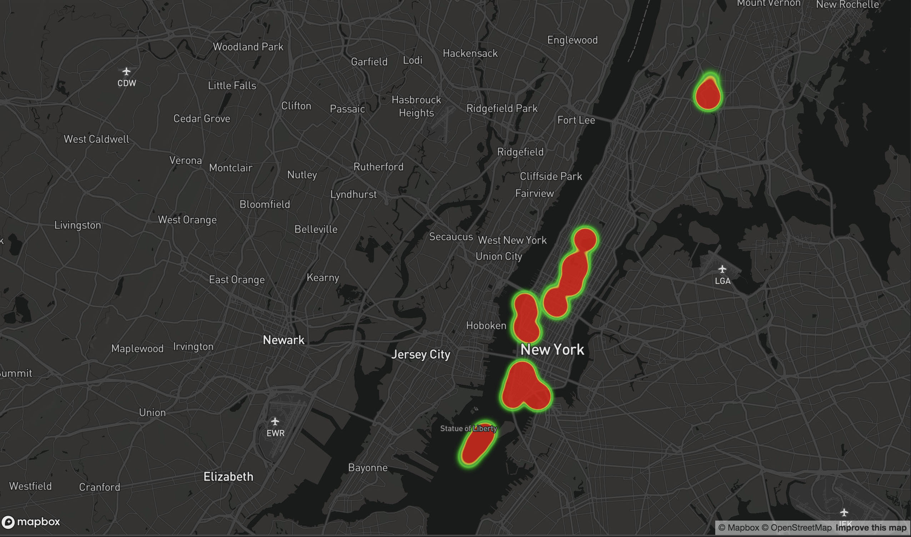

Display EXIF data from your photos on a heatmap.

# Getting started

1. Process your images into geoJSON with [this script](https://github.com/davidmerrick/extract-exif-as-geojson).
2. Set up a [MapBox account](https://www.mapbox.com/) and login.
3. Grab a MapBox token from [here](https://www.mapbox.com/studio/account/tokens/).
4. Copy the `.env.example` file to `.env`, and paste in your MapBox token.
5. Put your EXIF geoJSON in `html/exif.geojson`.
6. Run `docker-compose build`.
7. Run `docker-compose up`.
8. Load [localhost:8080](http://localhost:8080) in your browser.

